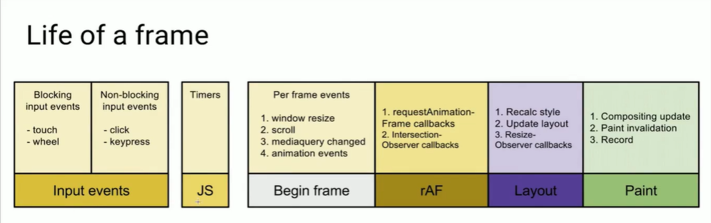
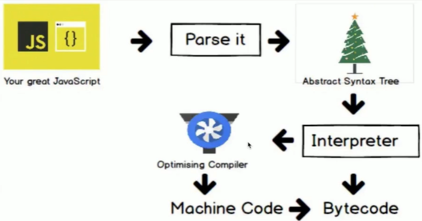

# Front-End-Performance-Optimization
## 性能优化的指标和工具
  > chrome devtool

    1. network中的瀑布图, TTFB
    2. Lighthouse
      - First Contentful Paint(首次渲染时间)
      - speed index(4s)
    3. FPS
    4. 交互
      - 异步请求要快, 1s之内完成, 不然就加loading
  > RAIL测量模型

    > 什么是RAIL
      1. Response响应
      2. Animation动画
      3. Idle空闲
      4. Load加载
    > RAIL评估标准
      1. 响应: 处理事件应在50ms以内完成
      2. 动画: 每10ms产生一帧
      3. 空闲: 尽可能增加空闲时间, 当用户交互时才有时间进行处理
      4. 加载: 在5s内完成内容加载并可以交互
  > 性能测量工具

    > Chrome DevTools开发调试, 性能评测
      - command+shift+p 输入block(network request blocking), 可以阻止某个文件的加载
      - performance 性能分析
      - network网络加载分析
    > Lighthouse 网站整体质量评估
      - npm安装lighthouse使用
      - Chrome DevTools中使用
    > WebPageTest 多测试地点, 全面性能报告
      - 瀑布图
      - first view 首次访问
      - repeat view 二次访问
      > 如何本地部署WebPageTest工具
  > 常用的性能测量APIs
    - 关键时间节点(Navigation Timing, Resource Timing)
    - 网络状态(Network APIs)navigator.connection
    - 客户端服务端协商(HTTP Client Hints) & 网页显示状态(UI APIs)

## 渲染优化
  > 浏览器的渲染流程

    JavaScript > Style > Layout > Paint > Composite
    - 解析器构造DOM树和CSSOM树
    - DOM + CSSOM > Render Tree
  > 布局和绘制

    - 渲染树只包含网页需要的节点
    - 布局计算每个节点精确的位置和大小 - "盒模型"
    - 绘制是像素化每个节点的过程
  > 影响回流的操作(reflow, 再次布局就叫回流)

    - 添加/删除元素
    - display: none
    - 移动元素位置
    - 操作styles
    - offsetLeft, scrollTop, clientWidth
    - 修改浏览器大小, 字体大小
  > 避免layout thrashing(布局抖动)

    - 避免回流
    - 读写分离
      - 要批量进行读, 再进行写
      - fastdom(github中搜索)
  > 复合线程(compositor thread)与图层(layers)

    - 将页面拆分图层进行绘制再进行复合
    - 利用DevTools了解网页的图层拆分情况
    - 那些样式仅影响复合
    > 不需要回流和重绘, 只需要复合的
      1. Position: transform: translate(npx, mpx)
      2. Scale: transform: scale(n)
      3. Rotation: transform: rotate(ndeg)
      4. Opacity: opacity: 0...1
    > 通过chrome devtools中layer可以看到那些是图层, 从而可以知道那些元素不会只会复合, 不会回流和重绘

  > 减少重绘

    - render中paint flashing可以看页面是否重绘
    - 使用动画时, 尽量使用transform减少重绘
    - 注意创建新的图层
  > 高频事件处理函数 防抖

    - 一帧的生命周期

  

    rAF在layout之前

    - 解决：

      - requestAnimation Frame callbacks（rAF）

      - 每次改动完成后调用requestAnimation

      - 解决防抖

      ```JavaScript
      let ticking = false;
      window.addEventListener("pointermove", (e) => {
        if (ticking) return;
        ticking = true;
        window.requestAnimationFrame(() => {
          do()
          ticking = false
        })
      })
      ```

  > React时间调度实现

## 代码优化

  > JavaScript的开销和如何缩短解析时间

    - 开销在哪

      - 加载

      - 解析&编译

      - 执行

    - 解决方案

      - Code splitting 代码拆分， 按需加载

      - Tree shaking 代码减重

      - 避免长任务

      - 避免超过1kB的行间脚本（浏览器对外联脚本有优化， 可以对外联脚本缓存等等优化方案， 所以内联脚本性能更差）

      - 使用rAF和rIC进行时间调度

  > V8编译原理



    - 源码 → 抽象语法树 → 字节码 → 机器码

    - 编译过程会进行优化

    - 运行时可能发生反优化
  > V8优化机制

    - 脚本流

      - 当脚本超过30kB时，会开个线程对这段脚本先进行解析

    - 字节码缓存

    - 懒解析

      - 先不解析函数内部的逻辑， 当使用时在进行解析
  > 函数优化

    - 相对于懒解析的是饥饿解析，指需要马上解析

    - 如何告诉V8，函数需要饥饿解析

      - 通过给函数体外层加小括号让函数不要懒解析而是马上解析

      > 但是压缩时可能会去掉括号， 如何解决？

      - 利用Optimize.js, webpack4.0已经解决掉

  > 对象优化

    - 以相同顺序初始化对象成员， 避免隐藏类的调整

    - 实例化后避免添加新属性

    - 尽量使用Array代替array-like对象

    - 避免读取超过数组的长度

      - 造成udefined和数字比较

      - 在原型链上查找

      - 避免元素类型转换

  > HTML优化

    - 减少iframes使用

    - 压缩空白符

    - 避免深层级嵌套

    - 避免table布局

    - 删除注释

    - CSS&JavaScript尽量外链

    - 删除元素默认属性

  > CSS 优化

    - 降低CSS对渲染的阻塞

      - 早一些加载CSS

    - 利用GPU完成动画

    - 使用contain属性

    - 使用font-display属性
## 资源优化

  > 资源的压缩与合并

    - 为什么

      1. 减少http请求数量

      2. 减少请求资源的大小

    - HTML压缩

  Minifier   [http://kangax.github.io/html-minifier/](http://kangax.github.io/html-minifier/)

    - CSS压缩

      - clean-css

    - JS压缩与混淆

      - webpack对js压缩

    - CSS JS文件合并

      - 若干小文件， maybe

      - 无冲突， 服务相同的模块， ok

      - 优化加载， no！

  > 图片优化

    - 图片格式
      - choose the right format
      - size appropriately
      - adapt intelligently
      - Compress carefully
      - Prioritize critical images
      - Lazy-load the rest
      - Take care with tools
    - 格式比较
      - JPG/JPEG优点: 压缩比例高
      - png质量好
    - 懒加载
      - 原生的图片懒加载方案
        - img标签中loading设为'lazy'
      - 第三方图片懒加载方案
        - verlok/lazyload
        - yall.js
        - Blazy
    - 渐进式图片
    - 响应式图片
      > img标签
      - Srcset属性的使用
      - Sizes属性的使用
      - picture的使用
  > 字体优化

    字体未下载完成时, 浏览器隐藏或自动降级,导致闪烁
    解决: 
      - font-display
      - 使用AJAX + Base64
        1. 解决兼容性问题
        2. 缺点: 缓存问题
    - 字体引入
      @font-face

## Webpack构建优化(未完待续)
  > convention over configuration

    webpack4.0中的mode
## 传输加载优化
  > Gzip压缩(经典好用, 必须会)
  > Keep Alive
  > HTTP缓存

    - Cache-Control/Expires
    - Last-Modified + If-Modified-Since
    - Etag + If-None-Match
  > Service Workers
     
     - 加速重复访问
     - 离线支持
     注意事项: 
     - 延长了首屏时间, 但总体时间少了
     - 兼容性
     - 只能在localhost或https下使用
  > HTTP/2

    > 现在很多网站已经使用了h2协议, 可以通过network下的protocol查看
    > http/2优势
      - 二进制传输
      - 请求响应多路复用
      - Server push
      > 小技巧: thisisunsafe
    > 只能工作在https下
    > 适合较高的请求量
  > 服务端渲染SSR

    基于next.js实现ssr
    什么时候使用ssr
      - 架构-大型, 动态页面, 面向公众用户
      - 搜索引擎排名